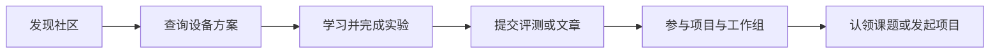
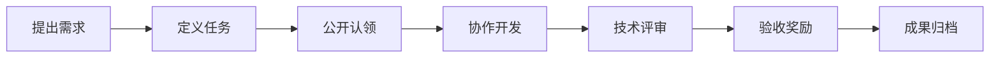
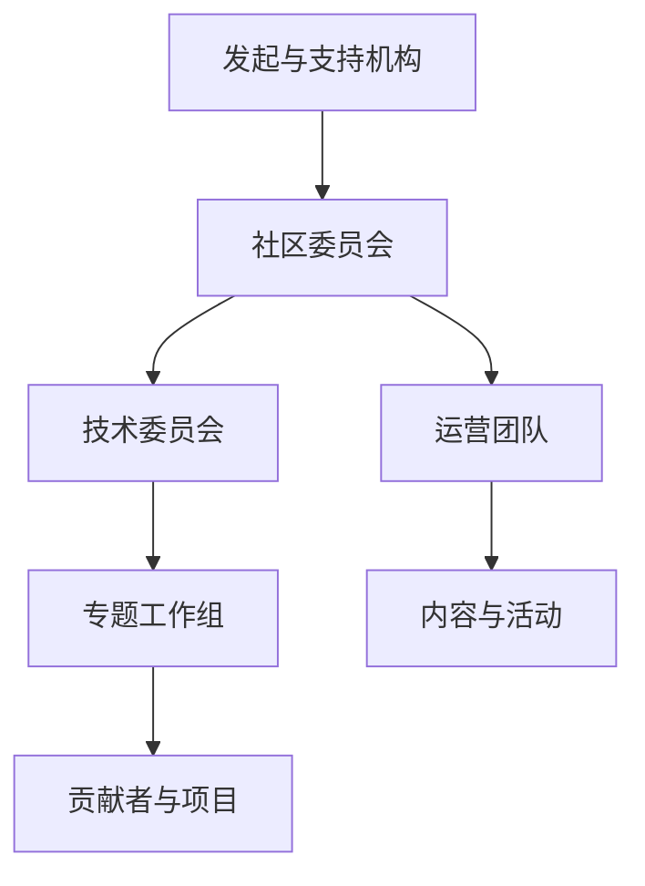

# Local AI Club 社区建设总体方案

> 域名：`local-ai.club`  
> 英文名：Local AI Club  
> 中文工作名称：Local AI 社区  
> 版本：V1.0（2026年8月）

## 一、项目摘要

Local AI Club 是面向本地、端侧、边缘与私有化 AI 的开放技术社区，服务于希望在个人设备、组织内部基础设施或数据产生现场运行 AI 的开发者、学生、研究者、开源项目、硬件厂商和行业用户。

社区不以“发布更多 AI 新闻”为主要目标，而是围绕五个真实问题组织内容与协作：

1. 我的设备能够运行哪些模型？
2. 如何选择模型、推理引擎、硬件与部署方式？
3. 如何把模型真正部署到个人、企业和现场环境？
4. 如何复现并比较质量、速度、资源消耗、成本和安全性？
5. 如何参与开源项目、解决真实课题，并获得认可或收益？

社区将建设技术知识库、课程体系、开放评测平台、开源项目图谱、参考实验室、课题悬赏平台和技术交流网络，逐步成为 Local AI 领域的公共知识基础设施与开放协作枢纽。

## 二、背景与机会

AI 的运行形态正在从单一的中心化云端调用，扩展为云端、本地、端侧、边缘和私有数据中心并存。个人电脑、AI PC、工作站、手机、浏览器、机器人和行业现场设备正在成为新的 AI 运行环境。

这一趋势带来明显需求：

- 数据不便离开本地或组织边界；
- 对离线运行、低延迟和稳定响应存在要求；
- 长期调用云端模型的成本较高或不可控；
- 用户需要掌握模型、数据、算力和应用的自主权；
- 开源模型、量化技术和推理引擎降低了本地运行门槛；
- 企业需要可信的技术选型、可复现评测和实施参考。

与此同时，当前信息仍然高度碎片化：模型、量化版本、推理引擎、设备和参数组合繁多；评测口径不一；教程很快过时；项目介绍缺少结构化比较；微信群和短视频中的知识难以长期沉淀。这为 Local AI Club 提供了清晰的公共价值空间。

## 三、概念边界

本方案中的 Local AI 是一个技术领域，而不是某个单一软件项目。它指：

> 主要在用户拥有或控制的设备与基础设施上运行，能够减少对中心化云端服务依赖的 AI 技术、产品与应用体系。

社区覆盖四类场景：

| 方向 | 典型环境 | 主要诉求 |
| --- | --- | --- |
| 个人本地 AI | PC、Mac、工作站、家庭服务器 | 隐私、低成本、个性化、离线使用 |
| 端侧 AI | 手机、平板、浏览器、可穿戴设备 | 低功耗、低延迟、离线运行 |
| 边缘 AI | 工厂、汽车、机器人、IoT设备 | 实时响应、可靠运行、现场决策 |
| 私有化 AI | 企业服务器、私有云、一体机 | 数据安全、组织可控、系统集成 |

社区关注但不限于：开放模型、模型量化与压缩、推理引擎、AI PC、NPU、RAG、本地 Agent、语音与多模态、浏览器 AI、移动端 AI、机器人、边缘设备、私有部署、安全与开源合规。

## 四、使命、愿景与价值主张

### 4.1 使命

让更多人能够在自己拥有和控制的设备上使用、开发并改进 AI。

### 4.2 愿景

成为 Local AI 领域可信赖的公共知识库、开放评测基础设施和项目协作网络。

### 4.3 价值主张

- 对学习者：提供清晰、连续、可实践的学习路径；
- 对开发者：提供项目、数据、工具、任务和公开贡献履历；
- 对开源项目：提供中文传播、用户反馈、适配测试和新贡献者；
- 对企业：提供技术选型、评测数据、人才与课题协作渠道；
- 对高校和研究机构：提供真实课题、实验环境与成果传播渠道；
- 对硬件厂商：提供开放、透明且可复现的应用验证场景。

## 五、用户体系

### 5.1 核心用户

1. 希望在个人电脑运行模型的 AI 爱好者；
2. 构建本地 AI 应用的开发者与独立创业者；
3. 从事模型优化、推理部署、端侧和边缘计算的工程师；
4. 高校学生、教师与研究人员；
5. 寻求私有化部署方案的企业技术人员；
6. 模型、软件、芯片、整机与边缘设备厂商；
7. Local AI 相关开源项目维护者。

### 5.2 典型用户旅程

## 六、业务架构

社区采用“学习—验证—构建—协作—传播”的闭环：

| 板块 | 用户问题 | 核心产物 |
| --- | --- | --- |
| Learn 学习 | 怎样入门和深入？ | 文章、教程、路线图、术语库 |
| Courses 课程 | 怎样系统掌握？ | 分级课程、训练营、项目作业 |
| Benchmarks 评测 | 什么组合适合我？ | 榜单、原始数据、评测脚本 |
| Projects 项目 | 有哪些工具可用？ | 项目图谱、对比页、贡献入口 |
| Agents 企业级Agent | 哪些Agent能在本地与企业环境可靠运行？ | Agent图谱、兼容矩阵、参考架构、实测案例 |
| Labs 实验室 | 怎样复现完整方案？ | 参考架构、Demo、配置清单 |
| Bounties 悬赏 | 有哪些真实问题可解决？ | 课题、任务、验收成果 |
| Cases 案例 | 别人怎样落地？ | 个人、企业和行业案例 |
| Community 社区 | 怎样找到同路人？ | 问答、工作组、活动与城市节点 |

## 七、核心产品与内容规划

### 7.1 技术知识库

知识库按技术专题而非发布时间组织，包括：

- 模型选择与运行入门；
- GGUF、量化、蒸馏和模型压缩；
- CPU、GPU、NPU、显存与统一内存；
- 推理引擎与API兼容；
- RAG、知识库和本地数据处理；
- 本地 Agent 与工具调用；
- 语音、视觉、图像生成与多模态；
- AI PC、移动端、浏览器与嵌入式设备；
- 私有部署、监控、权限与安全；
- 开源许可证、模型许可证和数据合规；
- 常见故障与版本兼容问题。

每篇实践内容应标明更新时间、模型版本、量化版本、软件版本、硬件环境和复现状态。

### 7.2 课程体系

课程分为四层：

| 层级 | 目标 | 代表性成果 |
| --- | --- | --- |
| L1 入门 | 在自己的设备运行第一个模型 | 环境截图与体验报告 |
| L2 应用 | 调用本地API，完成RAG或简单应用 | 可运行Demo |
| L3 工程 | 掌握量化、优化、部署和评测 | 评测报告或部署项目 |
| L4 专项 | 深入AI PC、移动端、边缘或企业场景 | 开源项目或行业方案 |

首批可推出三项课程：7天搭建个人 Local AI、21天本地 AI 应用开发、企业私有 AI 部署实战。

### 7.3 开放评测平台

建立模型、引擎、硬件和应用四层评测。核心指标包括：

- 能力：中文、推理、代码、工具调用、视觉、语音；
- 性能：首Token延迟、生成速度、吞吐、并发和稳定性；
- 资源：内存、显存、磁盘、功耗和运行温度；
- 工程：安装难度、兼容性、API支持和维护成本；
- 安全：离线能力、数据边界、默认暴露面与更新机制；
- 成本：硬件购置成本、能耗与单位任务成本。

每个结果必须附带“可复现清单”：模型校验信息、量化版本、引擎版本、操作系统、驱动、硬件、参数、数据集、提示词、脚本与原始结果。

优先建设两个工具：

1. 我的设备能运行什么模型；
2. 这个模型适合哪些硬件与推理引擎。

### 7.4 开源项目图谱

项目档案应包含定位、许可证、维护状态、支持模型、硬件、操作系统、模型格式、部署方式、API兼容性、中文支持、快速体验、相似项目比较、贡献入口和社区实测记录。

### 7.5 企业级 Agent 中心

Agent 栏目特指能够连接本地模型、私有推理服务和企业内部系统，并满足企业部署、运维、安全与治理要求的 Agent。它不是泛化的聊天机器人资讯栏目，也不把“能够调用模型”视为企业级能力。

重点覆盖：

- 企业知识与办公 Agent；
- 软件研发与运维 Agent；
- 客服、销售、财务、人力等业务流程 Agent；
- 制造、医疗、教育、政务等行业 Agent；
- 多 Agent 协作平台与 Agent Runtime；
- Agent 的安全、评测、监控和治理工具。

每个 Agent 档案应展示以下能力：

| 维度 | 核心问题 |
| --- | --- |
| 本地模型兼容 | 是否支持开放API、本地推理引擎、模型网关和离线运行？ |
| 企业集成 | 是否能连接数据库、文档、代码仓库、办公系统和业务API？ |
| 身份与权限 | 是否支持SSO、RBAC、数据权限继承和服务账号？ |
| 安全隔离 | 工具、代码、文件和网络访问是否可控，是否具备沙箱？ |
| 审计与可观测 | 是否记录提示词、检索、工具调用、决策、成本和结果？ |
| 可靠性 | 是否支持重试、超时、回滚、人工确认、任务恢复和高可用？ |
| 评测与治理 | 是否具备效果评测、风险测试、版本管理和审批发布机制？ |
| 部署与运维 | 是否支持私有部署、容器化、扩缩容、备份和升级？ |

社区应重点建设三项公共产品：

1. **Agent × 模型 × 推理引擎兼容矩阵**：回答某个Agent能否连接某类本地模型，以及功能损失和配置方法；
2. **企业级能力矩阵**：比较权限、审计、沙箱、可观测、可靠性和部署能力，避免仅凭产品宣传判断；
3. **企业 Agent 参考架构与实测案例**：提供从本地推理、模型网关、知识库、工具系统到治理平台的完整组合。

Agent 评测除任务完成率外，还应关注权限越界、提示词注入、错误工具调用、数据泄漏、任务恢复、人工接管、并发稳定性和单位任务成本。

### 7.6 课题悬赏平台

悬赏范围包括功能开发、Bug修复、硬件适配、模型量化、中文文档、性能优化、评测补充、参考应用、行业研究和高校课题。

每项任务必须明确交付物、验收标准、许可证和知识产权、奖励、期限、评审人及成果发布方式。

### 7.7 社区交流网络

- 网站承载结构化内容与正式成果；
- GitHub承载代码、Issue、评测脚本和任务协作；
- Discourse或类似系统承载长期问答；
- 微信群承载即时交流和活动通知；
- 邮件通讯发布每周精选；
- B站、视频号等承载课程与技术演示；
- Meetup连接城市、高校和企业节点。

即时交流群中产生的高价值内容应整理回网站，避免知识只停留在聊天记录中。

## 八、社区组织与治理

### 8.1 组织结构

建议设立推理引擎、模型量化、AI PC、端侧与Web AI、企业级Agent、边缘与具身智能、评测、安全与隐私、教育等工作组。企业级Agent工作组优先维护兼容矩阵、参考架构、评测规范和典型部署案例。工作组应以季度成果为导向。

天工开物开源基金会可承担公共基础设施、资金募集与托管、开源合规、高校企业合作、年度报告、活动和贡献者激励等职责。

### 8.2 基本治理原则

- 技术中立，不绑定单一模型、引擎或硬件；
- 评测方法、原始数据和修订过程尽可能公开；
- 赞助关系和利益冲突主动披露；
- 赞助可以支持评测，但不能购买评测结论；
- 内容具有勘误、版本和归档机制；
- 重要技术资产采用适当的开放许可证；
- 建立行为准则、申诉和仲裁机制。

### 8.3 贡献者成长体系

建议设置 Explorer、Contributor、Reviewer、Maintainer、Working Group Lead 五个成长阶段。代码、评测、文章、文档、答疑、活动、翻译和项目管理均计入贡献。

## 九、品牌与传播

### 9.1 品牌规范

- 统一写法：Local AI Club；
- 统一域名：`local-ai.club`；
- 推荐口号：让 AI 在每个人自己的设备上运行；
- 英文口号：Run AI Locally. Build AI Together.

为避免与现有 LocalAI 开源项目混淆，品牌文字中的 Local 与 AI 始终分开，并在网站页脚说明本社区为独立开放社区。

### 9.2 内容传播机制

- 每周：Local AI Weekly；
- 每月：模型、工具与硬件观察；
- 每季度：开放评测专题与社区Demo Day；
- 每年：《Local AI年度发展报告》和年度社区大会；
- 持续：项目访谈、开发者故事、行业案例和悬赏成果展示。

## 十、可持续发展模式

坚持“公共内容开放、专业服务收费”：

- 企业会员与年度赞助；
- 课题悬赏管理服务；
- 专业课程与训练营；
- 企业培训、技术选型与咨询；
- 联合实验室和适配计划；
- 研究报告和行业活动；
- 开放评测、认证与互操作计划。

所有商业合作均不得损害评测独立性、社区开放性和用户信任。

## 十一、实施路线图

### 第一阶段：最小可行社区（0—3个月）

- 完成品牌、域名、官网和贡献指南；
- 发布50篇基础内容、30个项目档案；
- 建立一门免费入门课程；
- 发布10组可复现实测数据；
- 上线设备选型工具的首个版本；
- 建立企业级Agent栏目的首批20个结构化档案；
- 建立GitHub组织和社区交流渠道；
- 发布首批5个公开悬赏任务；
- 每周举办一次线上交流。

### 第二阶段：形成协作机制（3—6个月）

- 发布Local AI技术图谱和评测规范；
- 上线硬件—模型—引擎兼容数据库；
- 发布首版Agent—模型—引擎兼容矩阵和企业Agent参考架构；
- 启动专题工作组和贡献者体系；
- 举办首期训练营与Demo Day；
- 联合3—5家企业发布课题；
- 建立公开贡献档案。

### 第三阶段：形成行业影响（6—12个月）

- 发布年度发展报告；
- 举办年度大会或挑战赛；
- 建设联合实验室；
- 发布参考硬件配置和技术架构；
- 建立高校、城市和企业节点；
- 推动优秀成果进入上游开源项目。

## 十二、首年目标与指标

| 指标 | 首年目标 |
| --- | ---: |
| 有效注册用户 | 1,000 |
| 月度活跃贡献者 | 100 |
| 原创技术内容 | 200篇 |
| 结构化项目档案 | 100个 |
| 企业级Agent档案 | 50个 |
| Agent兼容性与部署实测 | 30组 |
| 可复现实测数据 | 100组 |
| 公开悬赏任务 | 30个 |
| 完成验收的开源成果 | 10项 |
| 体系化课程 | 5门 |
| 合作高校 | 10所 |
| 参与企业 | 20家 |

北极星指标建议采用：**每月产生有效公共技术成果的活跃贡献者人数**。有效成果包括被收录的文章、评测、项目更新、实验、问答、代码、悬赏交付和活动资料。

## 十三、主要风险与应对

| 风险 | 应对方式 |
| --- | --- |
| 与LocalAI项目品牌混淆 | 坚持“Local AI Club”分词写法，增加独立社区说明 |
| 内容快速过时 | 标记版本和更新时间，建立复测与归档机制 |
| 评测公信力不足 | 方法、脚本、原始数据开放，实行利益冲突回避 |
| 社群热闹但成果稀少 | 工作组以季度交付物为目标，强化成果归档 |
| 早期栏目过多 | 先做设备选型、知识库、项目图谱和评测四项核心能力 |
| 商业合作影响中立性 | 公开赞助关系，商业团队与评测结论适度隔离 |
| 贡献者流失 | 降低首次贡献门槛，建立导师、认可、履历和悬赏机制 |

## 十四、近期行动清单

1. 完成域名解析、品牌账号和GitHub组织；
2. 确认3—5人的发起团队和职责；
3. 制定内容、项目和评测三套数据模板；
4. 招募首批20名发起贡献者；
5. 选择10组典型硬件作为首轮评测对象；
6. 筹备免费入门课程和首批5项悬赏；
7. 在90天内上线MVP并发布社区召集令。

---

Local AI Club 的长期目标不是成为最大的 Local AI 资讯站，而是建设一个让任何人都能选择、运行、评测、开发和贡献本地 AI 的开放协作平台。
