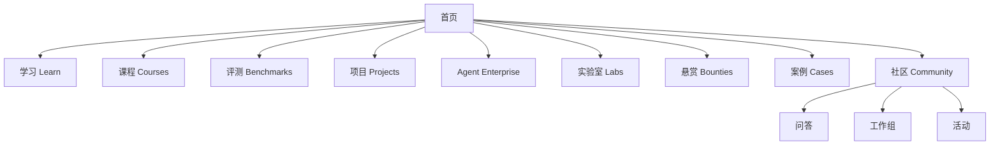

# local-ai.club 网站产品需求文档（PRD）

> 产品：Local AI Club  
> 域名：`local-ai.club`  
> 版本：V1.0  
> 文档状态：MVP规划稿

## 1. 产品概述

local-ai.club 是 Local AI Club 的核心数字平台。它不只是内容发布网站，而是连接知识、评测、项目、实验、课题与人的社区工作平台。

MVP首先解决两个高频任务：

1. 用户输入自己的设备和用途，获得可运行模型与技术栈建议；
2. 用户围绕某个模型、引擎或硬件，找到可信教程、实测数据、项目和参与入口。

## 2. 产品目标

### 2.1 用户目标

- 新手能够在30分钟内找到适合其设备的第一套Local AI方案；
- 开发者能够快速比较模型、引擎和硬件；
- 贡献者能够找到清晰、可完成、可获得认可的任务；
- 企业能够发布真实课题并找到合适的解决者；
- 社区能够把分散交流转化为可搜索、可复用的公共成果。

### 2.2 业务目标

- 建立Local AI领域可信的结构化内容资产；
- 形成“内容—实验—评测—项目—课题”的协作闭环；
- 为课程、赞助、研究、活动和企业服务提供基础平台；
- 建立可度量的贡献者成长与社区治理机制。

### 2.3 非目标

MVP阶段暂不建设：

- 自有模型托管和大文件分发；
- 完整在线训练或云端推理平台；
- 自行开发即时聊天系统；
- 复杂积分商城与虚拟货币；
- 大而全的招聘平台；
- 缺少验收机制的自由交易市场。

## 3. 用户角色

| 角色 | 主要需求 | 关键动作 |
| --- | --- | --- |
| 访客/学习者 | 快速入门、找到设备方案 | 搜索、筛选、收藏、学习 |
| 开发者 | 查资料、比较性能、参与项目 | 提交文章、评测、Issue、Demo |
| 评测贡献者 | 发布可复现实测 | 创建测试记录、上传数据和脚本 |
| 项目维护者 | 展示项目、获得用户与贡献 | 认领项目页、发布动态和任务 |
| 课题发布方 | 找到解决者 | 创建悬赏、答疑、评审和验收 |
| 评审者 | 保证内容与技术质量 | 审核、复测、勘误、验收 |
| 工作组负责人 | 组织专题协作 | 维护路线图、活动和季度成果 |
| 管理员 | 运营平台 | 权限、内容、用户、数据和风控 |

## 4. 核心使用场景

### 场景A：设备选型

用户选择操作系统、芯片/GPU、内存或显存、用途和是否要求完全离线。系统返回：

- 推荐模型及量化版本；
- 推荐推理引擎；
- 预计资源占用与速度区间；
- 安装教程；
- 相似设备的真实评测；
- 风险和注意事项。

### 场景B：技术选型

用户搜索某个模型或引擎，进入实体详情页，查看介绍、兼容关系、评测、教程、项目和社区讨论，并进行横向比较。

### 场景C：完成一次可复现实测

贡献者从评测模板开始，填写环境与参数，运行开放脚本，提交原始结果；评审者检查完整性并标记复现状态。

### 场景D：参与开源项目

用户在项目图谱中按技术栈和难度筛选项目，查看“适合首次贡献”的任务，跳转协作平台或在站内提交贡献记录。

### 场景E：课题悬赏

企业或社区提出需求，经编辑完善为可验收任务；贡献者认领并公开协作；评审完成验收后发布成果和贡献证明。

### 场景F：选择和部署企业级 Agent

企业用户选择业务场景、本地模型服务、部署环境和治理要求，系统返回可选 Agent、兼容程度、必要组件、能力缺口、参考架构、评测和部署案例。用户可以进一步比较两到三个方案。

## 5. 信息架构

推荐URL：

| 页面 | URL |
| --- | --- |
| 首页 | `/` |
| 学习中心 | `/learn` |
| 课程 | `/courses` |
| 评测中心 | `/benchmarks` |
| 设备选型 | `/benchmarks/device-advisor` |
| 项目图谱 | `/projects` |
| 企业级Agent | `/agents` |
| Agent详情 | `/agents/{slug}` |
| Agent兼容矩阵 | `/agents/compatibility` |
| 实验室 | `/labs` |
| 课题悬赏 | `/bounties` |
| 应用案例 | `/cases` |
| 社区 | `/community` |
| 工作组 | `/working-groups` |
| 活动 | `/events` |
| 搜索 | `/search` |
| 用户主页 | `/u/{username}` |
| 关于 | `/about` |

## 6. MVP功能范围

### P0：必须上线

1. 首页与全站导航；
2. 统一搜索；
3. 文章列表、详情、专题和标签；
4. 项目列表、详情和结构化筛选；
5. 企业级Agent列表、详情、分类与本地模型兼容信息；
6. 评测列表、详情和环境信息；
7. 设备选型工具V1；
8. 课程列表与课程详情；
9. 悬赏列表、详情和认领入口；
10. 社区活动、工作组与外部讨论入口；
11. 用户注册、登录、个人主页和收藏；
12. 内容提交、审核、勘误与版本记录；
13. 基本运营后台。

### P1：上线后迭代

- 模型、硬件、引擎横向比较；
- Agent—模型—引擎兼容矩阵和Agent横向比较；
- 企业Agent参考架构与部署案例库；
- 评测数据在线提交与复现状态；
- 项目维护者认领项目主页；
- 贡献者等级、徽章和贡献档案；
- 悬赏完整工作流与验收记录；
- 邮件周报订阅；
- 中英文内容能力；
- API与开放数据导出。

### P2：中长期

- 自动读取GitHub项目元数据；
- 自动运行标准化评测任务；
- 设备配置众包数据库；
- 企业课题工作台；
- 高校教学和班级空间；
- 城市与高校社区节点页面；
- 年度报告数据看板。

## 7. 页面需求

### 7.1 首页

首页目标：让首次访问者在10秒内理解社区，并立即完成一次有价值的动作。

首屏包括：

- 品牌与定位语；
- “我的设备能运行什么模型”快速选择器；
- “查看推荐方案”主按钮；
- 搜索入口；
- 当前社区数据摘要。

首屏之后依次展示：

1. 本周精选内容；
2. 热门评测；
3. 活跃项目；
4. 企业级Agent与参考架构；
5. 最新悬赏；
6. 学习路径；
7. 活动与工作组；
8. 参与贡献召集。

### 7.2 学习中心

支持按难度、主题、内容类型、运行平台和更新时间筛选。文章卡片必须显示标题、摘要、难度、预计阅读时间、适用环境、更新时间和复现状态。

### 7.3 课程

课程详情包括学习目标、先修条件、章节、实践任务、预期成果、教师/维护者、许可证、更新状态和学习入口。MVP可跳转外部视频或仓库，不强制自建视频系统。

### 7.4 评测中心

评测列表支持按对象类型、设备、模型、引擎、任务、量化方式和复现状态筛选。

详情必须展示：

- 一句话结论及适用边界；
- 测试环境；
- 关键性能指标；
- 方法和数据集；
- 原始数据与脚本；
- 复现记录；
- 勘误与版本历史；
- 利益关系披露。

### 7.5 设备选型工具

输入字段：

- 平台：Windows、macOS、Linux、Android、iOS、Web/浏览器；
- 处理器或GPU；
- 内存和显存；
- 主要用途：通用对话、编程、文档问答、视觉、语音、Agent；
- 优先级：速度、质量、低资源、长上下文；
- 是否必须离线；
- 技术水平：新手、开发者、专家。

输出字段：

- 推荐模型与量化；
- 推荐引擎与界面工具；
- 预计资源占用；
- 预计性能区间及数据来源；
- 一键查看教程；
- 相似配置实测；
- 替代方案。

MVP采用规则表，不承诺精确性能预测；所有区间注明样本数量和置信程度。

### 7.6 项目图谱

支持按类别、许可证、平台、模型格式、硬件后端、API兼容、维护状态和贡献难度筛选。

项目详情应显示：项目定位、维护状态、许可证、支持矩阵、快速开始、实测、教程、最新版本、相似项目、贡献入口和社区维护者。

### 7.7 企业级 Agent

本栏目只收录能够与本地或私有模型协同运行，并具备企业部署价值的 Agent、Agent平台和关键治理组件。普通聊天客户端、仅提供云端封闭模型且无法私有部署的产品不作为核心收录对象。

Agent列表支持按以下维度筛选：

- 场景：企业知识、办公、研发、运维、客服、销售、数据分析、行业应用；
- 形态：单Agent、多Agent、工作流平台、Agent Runtime、治理平台；
- 模型连接：开放API、模型网关、本地推理引擎、离线模式；
- 部署：桌面、服务器、容器、Kubernetes、私有云、边缘设备；
- 企业能力：SSO、RBAC、审计、沙箱、人工确认、可观测、高可用；
- 开放性：代码许可证、插件协议、数据可导出性和供应商锁定程度。

Agent详情页包括：

- 产品定位、适用场景与成熟度；
- 支持的模型、推理引擎、API和上下文能力；
- 工具、MCP、插件、知识库和企业系统连接能力；
- 身份、权限、数据边界、沙箱与密钥管理；
- 任务状态、重试、回滚、人工接管和任务恢复；
- 日志、Trace、评测、成本和审计能力；
- 单机、集群、私有云和离线部署方式；
- 社区实测、参考架构、已知限制和安全记录；
- 许可证、商业版本、维护状态和贡献入口。

兼容结果必须区分“能够调用文本生成接口”“支持工具调用”“支持结构化输出”“支持多模态”“支持长任务和状态恢复”等不同层级，不能将简单API连通标记为完全兼容。

### 7.8 课题悬赏

列表展示奖励、难度、类型、截止时间、状态和发布方。详情展示背景、范围、交付物、验收标准、许可证、知识产权、评审、里程碑和公开问答。

任务状态：草拟、招募中、已认领、执行中、评审中、已完成、已取消。

### 7.9 社区

聚合问答入口、工作组、活动、每周通讯和贡献指南。MVP不重复开发论坛，可与GitHub Discussions、Discourse和微信群协同。

## 8. 内容模型

### 8.1 核心实体

| 实体 | 关键字段 |
| --- | --- |
| Article | 标题、摘要、正文、主题、难度、环境、作者、版本、复现状态 |
| Course | 目标、先修、章节、任务、成果、教师、更新状态 |
| Model | 名称、版本、参数、许可证、模态、格式、量化版本 |
| Engine | 名称、版本、平台、硬件后端、API、模型格式、许可证 |
| Hardware | 厂商、型号、CPU/GPU/NPU、内存/显存、系统 |
| BenchmarkRun | 模型、引擎、硬件、参数、数据集、指标、原始数据、状态 |
| Project | 定位、仓库、许可证、类别、兼容矩阵、维护状态 |
| Agent | 场景、形态、模型接口、工具协议、企业能力、部署、许可证、成熟度 |
| AgentCompatibility | Agent、模型、引擎、功能层级、配置、限制、测试版本、证据 |
| AgentDeployment | 参考架构、组件、权限、安全、可观测、容量、成本、验证结果 |
| Lab | 目标、架构、物料清单、步骤、验证结果、仓库 |
| Bounty | 背景、交付物、验收、奖励、期限、许可、状态 |
| Event | 类型、时间、地点、嘉宾、报名、资料 |
| User | 简介、技能、设备、贡献、徽章、外部账号 |

实体之间应建立可导航关系。例如从一款硬件进入相关评测、模型、教程和项目；从某个项目进入教程、Issue、评测和悬赏。

## 9. 搜索与发现

统一搜索同时覆盖文章、课程、模型、引擎、硬件、项目、Agent、评测、实验和悬赏。结果支持按实体类型、主题、难度和更新时间过滤。

站内推荐优先使用明确关系与编辑精选，不在MVP阶段依赖复杂个性化算法。

## 10. 投稿、审核与版本

内容状态：草稿、待审核、需修改、已发布、已归档。

审核维度：

- 信息是否完整；
- 是否明确软硬件版本；
- 结论是否超出数据范围；
- 是否包含必要来源；
- 是否披露商业关系；
- 许可证是否清晰；
- 是否存在安全与合规风险。

评测内容需要至少一名技术评审；标记为“已复现”需要独立环境的第二次成功运行。重要内容保留修改历史和公开勘误。

## 11. 权限设计

| 权限 | 访客 | 注册用户 | 贡献者 | 评审者 | 工作组负责人 | 管理员 |
| --- | :---: | :---: | :---: | :---: | :---: | :---: |
| 浏览与搜索 | ✓ | ✓ | ✓ | ✓ | ✓ | ✓ |
| 收藏和订阅 |  | ✓ | ✓ | ✓ | ✓ | ✓ |
| 评论/提问 |  | ✓ | ✓ | ✓ | ✓ | ✓ |
| 提交内容 |  | ✓ | ✓ | ✓ | ✓ | ✓ |
| 直接发布 |  |  | 部分 | 部分 | 组内 | ✓ |
| 技术评审 |  |  |  | ✓ | ✓ | ✓ |
| 悬赏验收 |  |  |  | 指定 | 指定 | ✓ |
| 用户与全站管理 |  |  |  |  |  | ✓ |

## 12. 非功能需求

### 12.1 性能

- 首页主要内容在普通移动网络下快速可见；
- 图片使用现代格式、响应式尺寸和延迟加载；
- 列表筛选响应目标小于300毫秒；
- 搜索结果目标在1秒内返回。

### 12.2 可访问性

- 键盘可操作；
- 清晰的焦点状态；
- 语义化标题和表单标签；
- 颜色对比符合WCAG AA基本要求；
- 移动端触控目标不小于合理尺寸。

### 12.3 安全与隐私

- 最小化收集个人信息；
- 明确公开资料与私密资料边界；
- 防范恶意链接、脚本和模型文件；
- 不直接执行用户上传的未知模型或代码；
- 管理员使用多因素认证；
- 重要操作保留审计记录。

### 12.4 开放性

- 评测方法、字段和公开数据支持导出；
- 公开内容标注许可证；
- 为未来API预留稳定实体ID；
- 项目数据允许维护者申请纠错。

## 13. 视觉与交互原则

- 技术可信，但避免传统企业官网的沉重感；
- 首屏提供工具价值，不堆叠口号；
- 使用深色墨蓝、信号绿和暖色强调，形成“本地运行、设备指示灯、实验台”的品牌联想；
- 数据页重视表格、标签、版本和来源；
- 内容页保证长文阅读舒适；
- 所有关键卡片都提供清晰的下一步动作；
- MVP中的预测结果明确标识为估算或社区样本。

## 14. 数据与指标

### 北极星指标

每月产生有效公共技术成果的活跃贡献者人数。

### 漏斗指标

1. 访问首页；
2. 使用设备选型或搜索；
3. 浏览详情或教程；
4. 注册、收藏或订阅；
5. 完成实验；
6. 提交内容或贡献；
7. 三个月内再次贡献。

### 产品指标

- 设备选型工具完成率；
- 推荐结果进入教程的点击率；
- 搜索无结果率；
- 内容过期率；
- 评测可复现率；
- Agent档案完整率与兼容性实测覆盖率；
- 企业Agent参考架构被复用或验证的数量；
- 项目档案被维护者认领率；
- 悬赏认领率和按期验收率；
- 新贡献者90日留存率。

## 15. 技术实现建议

### MVP架构

- 前端：支持服务端渲染的现代Web框架；
- 内容：Git驱动Markdown/MDX或带版本能力的Headless CMS；
- 结构化数据：关系数据库；
- 搜索：初期使用数据库全文搜索，后续使用独立搜索服务；
- 身份：支持邮箱和GitHub登录；
- 讨论：优先集成GitHub Discussions或Discourse；
- 代码与评测：GitHub仓库与自动化任务；
- 数据分析：注重隐私的站点分析工具。

内容与结构化实体应分离：文章适合Markdown，模型—硬件—引擎—评测关系适合数据库。

## 16. 里程碑与验收

### M0：原型（第1—2周）

- 首页与主要栏目可点击原型；
- 设备选择器能够输出示例方案；
- 完成用户访谈并整理反馈。

### M1：内部测试版（第3—6周）

- P0页面可用；
- 导入首批文章、项目和评测；
- 完成账号、搜索和投稿流程；
- 20名发起贡献者试用。

### M2：公开MVP（第7—12周）

- 设备选型工具V1上线；
- 50篇内容、30个项目、10组评测；
- 免费入门课程和5个悬赏上线；
- 基础治理规则和运营流程发布。

### MVP验收标准

- 新用户无需指导能够完成设备选型；
- 所有核心实体可搜索并相互跳转；
- 文章、项目和评测具备统一数据模板；
- 内容可以投稿、审核、勘误和归档；
- 移动端能够完成浏览、搜索和收藏；
- 关键行为均有数据指标；
- 不存在阻断主流程的严重可访问性或安全问题。

## 17. 待决策事项

1. 中文正式名称是否长期使用“Local AI 社区”；
2. 账号系统是否首期开放，还是先采用GitHub身份；
3. 讨论系统选用GitHub Discussions还是Discourse；
4. 首批评测硬件和模型清单；
5. 内容默认许可证与评测数据许可证；
6. 悬赏资金托管、合同和税务流程；
7. 是否从第一天提供英文界面。

这些事项不阻碍原型和首批内容准备，但应在M1开发启动前完成决策。
